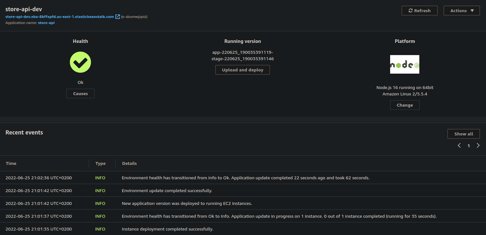
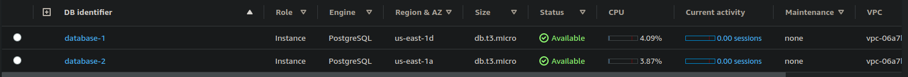
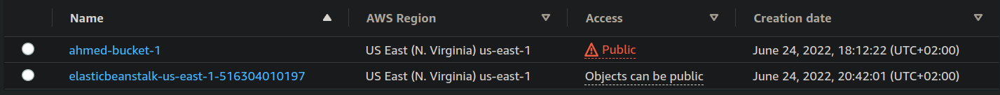
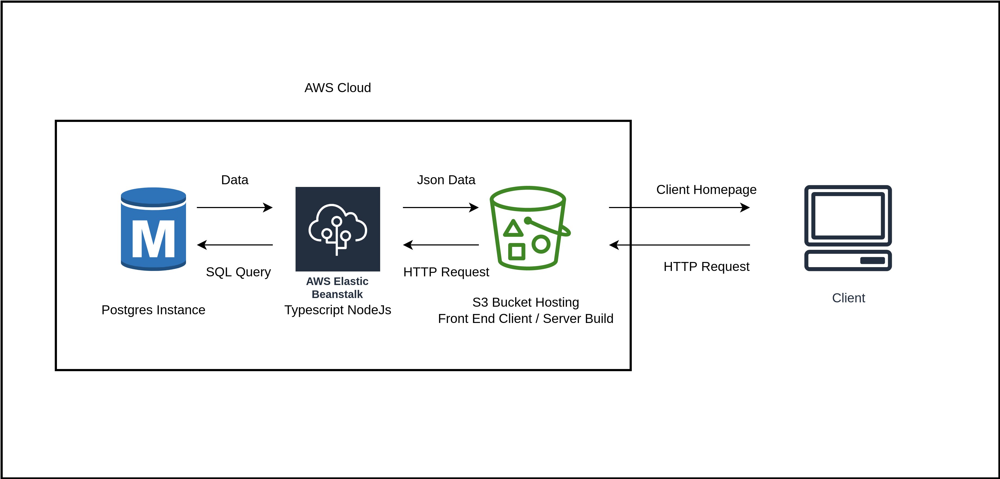

# Store Front API

## Project Structure

```sh
.
├── client
│   ├── public
│   └── src
├── Docs
│   └── imgs
└── server
    ├── bin
    ├── dist
    │   ├── config
    │   ├── Controllers
    │   ├── Errors
    │   ├── Handlers
    │   ├── Middleware
    │   ├── Models
    │   └── tests
    │       └── helpers
    ├── imgs
    ├── migrations
    │   └── sqls
    ├── spec
    │   └── support
    └── src
        ├── config
        ├── Controllers
        ├── Errors
        ├── Handlers
        ├── Middleware
        ├── Models
        └── tests
            └── helpers


```

- **`./server/dist`** : Server Build Files
- **`./server/src`**: Typescript Source Files 
  - **`./server/src/test`** : Includes the Test Scripts
- **`./client/src`**: Include Client Source Files
- **`./server/migrations`** : Include PostgreSQL Migration Scripts

## Deployment Structure

Store Front API is deployed through Amazon Web Services using Elastic Beanstalk (EBS), Relational Database Service (RDS) and Scalable Storage (S3). Each service holds a crucial role in our API Deployment.

### Elastic Beanstalk

`AWS Elastic Beanstalk is an orchestration service offered by Amazon Web Services for deploying applications which orchestrates various AWS services, including EC2, S3, Simple Notification Service, CloudWatch, autoscaling, and Elastic Load Balancers.` EBS is used to create and manage the development environment for our API, Created with `NodeJs -16` in `us-east-1` Region which will hold the Server Side API used for this project. EBS can be created through the AWS Console or from the CLI with the following steps. 

```sh
# Initiate the Application ,,, First Configure the AWS CLI with AWS Keys 
eb init <Application_name> --platform node.js-16 --region us-east-1
# Create Environment 
eb create --sample <Environment_name>
# Deploy
eb deploy

# Setting Environment Variables 
eb setenv ENV_VAR=ENV_VAR_VAL 
```

EBS is where the Server lies and all the Requests to te Servers are passed through here and to the Database RDS.



### Relational Database Service

`Amazon Relational Database Service (Amazon RDS) is a collection of managed services that makes it simple to set up, operate, and scale databases in the cloud.` RDS is where our Database lies, It is simple to create and RDS instance from the AWS Console, Search for RDS and then Create Instance with a Free Tier Option. For more info follow this [link](https://docs.aws.amazon.com/AmazonRDS/latest/UserGuide/CHAP_Tutorials.WebServerDB.CreateDBInstance.html). We Created an instance for both Testing and Production, both used a PostgreSQL Engine.



### S3 Buckets

`Amazon S3 or Amazon Simple Storage Service is a service offered by Amazon Web Services that provides object storage through a web service interface. Amazon S3 uses the same scalable storage infrastructure that Amazon.com uses to run its e-commerce network.` S3 is a Cloud Storage provided by AWS. We uploaded our Front-End Client onto the displayed bucket `ahmed-bucket-1`, not so original, The Other Bucket is created by EBS to host the Server Code files. S3 can host Static Web pages we needed to identify this Property from the Configuration of the Bucket. For more info on how to create a bucket [link](https://docs.aws.amazon.com/AmazonS3/latest/userguide/create-bucket-overview.html).



## Infrastructure Diagram

The Following Diagram shows how each service interact with the other and the location of the API Parts.

