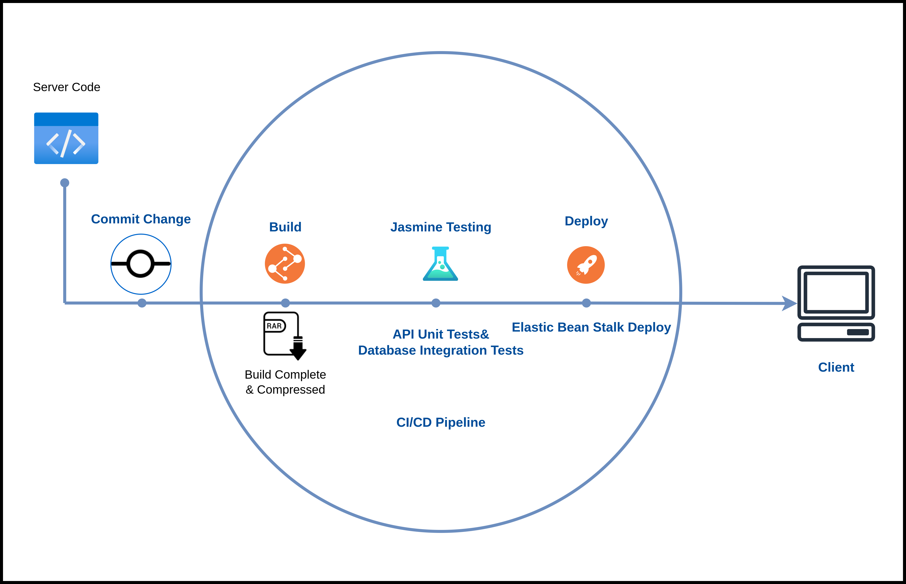
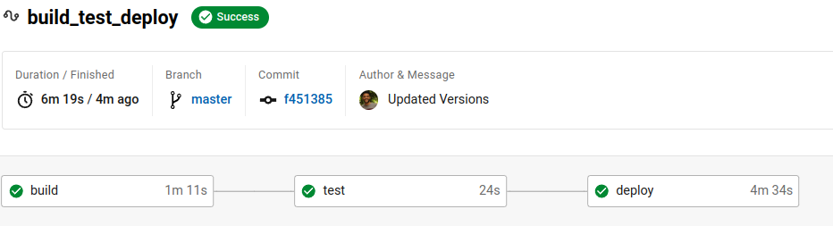

# Store Front API

Store Front API is deployed using  CircleCI which is a  CI/CD  Tool . 

## Pipeline

Defined at [.circleci](../.circleci) is the Process the Project goes through from Pushing new code to the Repository until it reached Production. The Final Deployed Version of the Application is Tested and Built Automatically each Update. 

### Steps:

- **Push** : Any Update Pushed through the Main Branch on the Git Repository launches a Trigger on the Circle CI Platform which starts the chain of Commands needed to Deploy the Latest Versions of the API.
- **Build** : The First Step in the Chain of Jobs performed by CircleCi is to Build the Project using the Provided Scripts defined in the Commands Section which uses the Scripts Configured in `package.json` presented in the Root Directory.
- **Test** : Apply all Automated Testing found in [specs](../server/src/tests) which test all aspects of the API before Deployment
- **Deploy** : Finally after all tests are passed deploy a compressed version of the Build into the Elastic Beanstalk Service using the Scripts defined at [bin](../server/bin)

## Commands

In this Section we Defined Reusable commands as stated in the Circle CI [Documentation](https://circleci.com/docs/2.0/concepts), These Commands will be used in the jobs section. Also added Scripts for Building and Deploying the Client Side.

```sh
# Application Re-usable Commands
commands:
  list_dirs:
    description: "List Current Environment Dirs"
    steps:
      - run:
          name: List ALL
          command: ls server/
  client_install:
    description: "Command for Client Installation"
    steps:
      - run:
          name: Client Install
          command: yarn client:install
  client_build:
    description: "Command for Building Client"
    steps:
      - run:
          name: Client Build
          command: yarn client:build
  client_deploy:
    description: "Command for Client Deploy"
    steps:
      - run:
          name: Client Deploy
          command: yarn client:deploy
  install_server:
    description: "Command for Server Installation"
    steps:
      - restore_cache:
          keys:
            - v2-dependencies-{{ checksum "package.json" }}
            - v2-dependencies-
      - run :
          name: Install Server Dependencies
          command: yarn server:install
      - save_cache:
          paths:
            - node_modules
          key: v2-dependencies-{{ checksum "package.json" }}
  build_server:
    description: " Runs Commands Responsible for Building the Server"
    steps:
      - run:
          name: Build Server
          command: yarn server:build
  test_server:
    description: " Runs Commands Responsible for Testing the Server"
    steps:
      - run:
          name: Test Server
          command: yarn server:test
  deploy_server:
    description: " Runs Commands Responsible for Deploying the Server"
    steps:
      - run:
          name: Deploy Server
          command: yarn server:deploy
```


### Jobs

The First Job is Build , it is the First job so it includes Installing the Server Dependencies using the Command `instal_server`, the last step, `persist_to_workspace` is used to preserve the installed modules in the following jobs. The other two jobs are Testing and Deployment both are attached to the persisted workspace, in the Deploy Step we configure the AWS CLI and the EB CLI. Both the AWS ID and Secret Keys are added to the Project's Environment Variables.

```yaml
# ........................ CI/CD Jobs ..................................
# Each Step in CI/CD Workflow below is defined here, using Circle CI   .
# persist_to_workspace to keep the build files for testing and deploy  .
# ......................................................................
jobs:
  build:
    docker:
      - image: cimg/base:stable

    steps:
      - node/install
      - node/install-yarn
      - checkout
      - install_server
      - build_server
      - client_install
      - client_build
      - persist_to_workspace:
          root: ./
          paths:
            - ./
  test:
    docker:
      - image: cimg/base:stable
    steps:
      - attach_workspace:
          at: ./
      - node/install
      - node/install-yarn
      - test_server
  deploy:
    docker:
      - image: "cimg/base:stable"
    steps:
      - attach_workspace:
          at: ./
      - node/install
      - node/install-yarn
      - aws-cli/setup
      - eb/setup
      - list_dirs
      - deploy_server
      - client_deploy

```


## Workflows

Finally a Work flow is defined to set the Pipeline for Circle CI to Deploy the API.

```yaml
# ...................... CI/CD Workflow ..............................
# The Server is build and tested using the defined jobs and commands .
# the Deployment then start using Elastic Beanstalk CLI              .
# ....................................................................
workflows:
  build_test_deploy:
    jobs:
      - build:
          filters:
            branches:
              only: master
      - test:
          requires:
            - build
      - deploy:
          requires:
            - test

```

## Pipeline Diagram



## Latest Build

[](https://dl.circleci.com/status-badge/redirect/gh/Ahmad-Abdalmageed/Store-API/tree/master)



