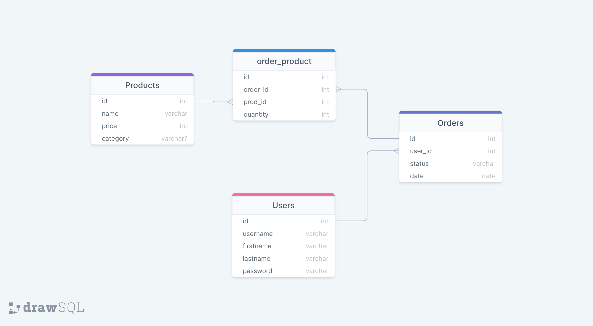

# Storefront API

## Pre-requisites

| Binaries   | Version          |
| ---------- | ---------------- |
| NodeJS     | >= 14.17.6 - LTS |
| NPM        | 8.12..1          |
| yarn       | >=1.22.19        |
| PostgreSQL | >= 14.3          |
| ts-node    | >= 10.8.1        |

Other Binaries and Versions are Included in `package.json` file.

## Project Structure

```sh
.
├── dist
│   ├── Controllers
│   ├── Errors
│   ├── Handlers
│   ├── Middleware
│   ├── Models
│   └── tests
│       └── helpers
├── imgs
├── migrations
│   └── sqls
├── spec
│   └── support
└── src
    ├── Controllers
    ├── Errors
    ├── Handlers
    ├── Middleware
    ├── Models
    └── tests
        └── helpers
```

- **`./dist`** : Server Build Files
- **`./src`**: Typescript Source Files 
  - **`./test`** : Includes the Test Scripts
- **`./migrations`** : Include PostgreSQL Migration Scripts

## Installation 

```sh
# Clone the Repo
git clone git@github.com:Ahmad-Abdalmageed/Store-API.git
cd ./Store-API

# Install the Dependencies listed in the package.json 
# You could also use npm install
yarn
```

## Connect to Database 

In order to Connect to the Database you need to create a new user, Connect to the PostgreSQL Server:

```sh
sudo -i -u postgre
createuser --interactive --pwprompt
```

Postgres will next ask you to enter new user details one by one, as shown below

- Enter name of role to add – store-api
- Enter password for new role – store-api-ahmed
- Enter it again – enter password again
- Shall the new role be a superuser- Enter Y

You can use your own user name and password but you will need to create an `.env` file with the Following variables:

```
POSTGRES_HOST={PostgreSQL Server Host}
POSTGRES_PORT={Connection Port}
POSTGRES_DB={Database Name}
POSTGRES_DB_TEST={Test Databse Name}
POSTGRES_USER={You user name}
POSTGRES_PASSWORD={Your Password}
```

The PostgreSQL Server host in this Application is 127.0.0.1 with the default port being 5432 (PostgreSQL Default), You can alternatively add your host and port by modifying the `.env` file.

Create the Database from the psql command prompt, add the Database name to the `.env` file as well.

```sh
psql
CREATE DATABASE {Database Name}
```

With that you are all set up to use the Database, and to set up the Tables you will need to run the Migration Script presented in the `package.json` File

```sh
db-migrate up
```

This command will create all needed tables for you. Finally to start the server you need to run

```sh
node ./dist/server.js
```


### API Reference

#### Products

- Index

```http
  GET '/api/v1/store/products/'
```

- Show

```http
  GET '/api/v1/store/products/:pid'
```

- Create : Authentication Added

```http
  POST '/api/v1/store/products/'
```

- Delete

```http
  DELETE '/api/v1/store/products/:pid'
```

####  Users

- Index: including Authentication

```http
  GET '/api/v1/store/users'
```

- Show

```http
  GET '/api/v1/store/users/:uid'
```

- Create

```http
  POST '/api/v1/store/users/'
```

- Delete

```http
  DELETE '/api/v1/store/users/:uid'
```

- Sign In

```http
  GET '/api/v1/store/users/login'
```

####  Orders

All Routes include Authentication

- Index

```http
  GET '/api/v1/store/orders/'
```

- Show

```http
  GET '/api/v1/store/orders/:oid'
```

- Create

```http
  POST '/api/v1/store/orders/'
```

- Delete

```http
  DELETE '/api/v1/store/orders/:oid'
```

- Current Orders by User

```http
  GET '/api/v1/store/orders/users/:uid'
```

## Data Shapes

#### Products

| Column   | Type         | Assertions | Key     |
| -------- | ------------ | ---------- | ------- |
| id       | SERIAL       | NOT NULL   | Primary |
| name     | VARCHAR(100) | NOT NULL   | -       |
| price    | INTEGER      | NOT NULL   | -       |
| category | VARCHAR(100) | NOT NULL   | -       |

#### User

| Column    | Type        | Assertions | Key     |
| --------- | ----------- | ---------- | ------- |
| id        | SERIAL      | NOT NULL   | Primary |
| username  | VARCHAR(30) | NOT NULL   | -       |
| firstname | VARCHAR(30) | NOT NULL   | -       |
| lastname  | VARCHAR(30) | NOT NULL   | -       |
| password  | VARCHAR     | NOT NULL   | -       |

#### Orders

| Column  | Type        | Assertions | Key                   |
| ------- | ----------- | ---------- | --------------------- |
| id      | SERIAL      | NOT NULL   | Primary               |
| user_id | INTEGER     | NOT NULL   | Foreign Key --> users |
| status  | VARCHAR(20) | NOT NULL   | -                     |
| date    | TIMESTAMP   | NOT NULL   | -                     |


##### Orders X Products -- Many to Many Relationship

| Column   | Type    | Assertions | Key                      |
| -------- | ------- | ---------- | ------------------------ |
| id       | SERIAL  | NOT NULL   | Primary                  |
| order_id | INTEGER | NOT NULL   | Foreign Key --> orders   |
| prod_id  | INTEGER | NOT NULL   | Foreign Key --> products |
| quantity | INTEGER | NOT NULL   | -                        |





### FOR SUBMISSION PURPOSES ONLY

```
POSTGRES_HOST=127.0.0.1
POSTGRES_PORT=5432
POSTGRES_DB=store_api
POSTGRES_DB_TEST=store_api_test
POSTGRES_USER=store_api
POSTGRES_PASSWORD=store_api_ahmed
ENV=dev
PORT=3000
BCRYPT_PASSWORD=store_api_ahmed
SALT_ROUNDS=10
TOKEN_SECRET=store_api_123
```

