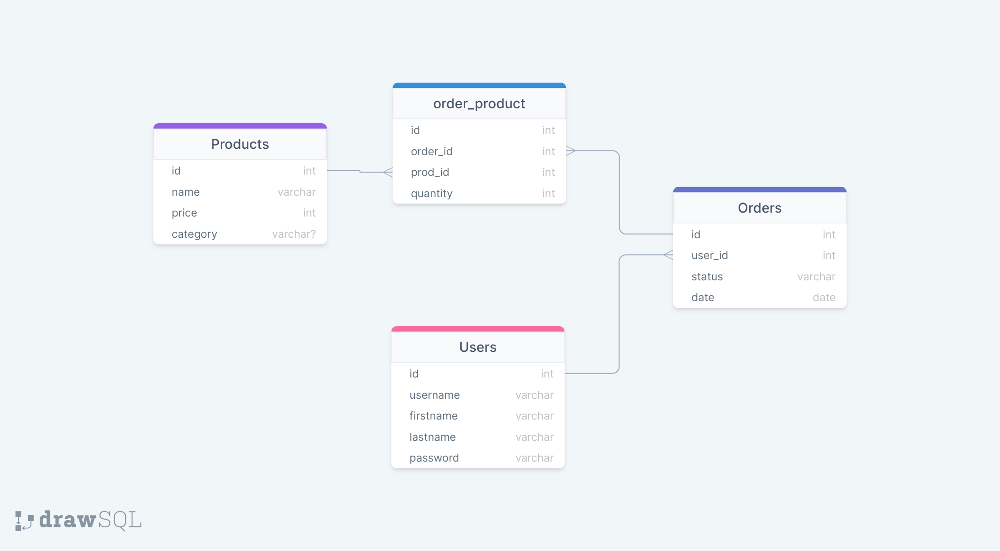

# Storefront API
[](https://dl.circleci.com/status-badge/redirect/gh/Ahmad-Abdalmageed/Store-API/tree/master)

A Typescript API used in building a Modern Storefront allowing numerous users to purchase Company's Products
## Pre-requisites

| Binaries   | Version          |
| ---------- | ---------------- |
| NodeJS     | >= 14.17.6 - LTS |
| NPM        | 8.12..1          |
| yarn       | >=1.22.19        |
| PostgreSQL | >= 14.3          |
| ts-node    | >= 10.8.1        |

Other Binaries and Versions are Included in `package.json` file.

## Project Structure

```sh
.
├── client
│   ├── public
│   └── src
├── Docs
│   └── imgs
└── server
    ├── bin
    ├── dist
    │   ├── config
    │   ├── Controllers
    │   ├── Errors
    │   ├── Handlers
    │   ├── Middleware
    │   ├── Models
    │   └── tests
    │       └── helpers
    ├── imgs
    ├── migrations
    │   └── sqls
    ├── spec
    │   └── support
    └── src
        ├── config
        ├── Controllers
        ├── Errors
        ├── Handlers
        ├── Middleware
        ├── Models
        └── tests
            └── helpers


```

- **`./server/dist`** : Server Build Files
- **`./server/src`**: Typescript Source Files 
  - **`./server/src/test`** : Includes the Test Scripts
- **`./client/src`**: Include Client Source Files
- **`./server/migrations`** : Include PostgreSQL Migration Scripts

## Installation

```sh
# Clone the Repo
git clone git@github.com:Ahmad-Abdalmageed/Store-API.git
cd ./Store-API/

# Install the Dependencies listed in the package.json 
# You could also use npm install
yarn install
```

## Connect to a Database Locally

In order to Connect to a Local Database you need to create a new user, Connect to the PostgreSQL Server:

```sh
sudo -i -u postgre
createuser --interactive --pwprompt
```

Postgres will next ask you to enter new user details one by one, as shown below

- Enter name of role to add – store-api
- Enter password for new role – store-api-ahmed
- Enter it again – enter password again
- Shall the new role be a superuser- Enter Y

You can use your own user name and password but you will need to create an `.env` file with the Following variables:

```
RDS_HOSTNAME    ={PostgreSQL Server Host}
RDS_PORT        ={Connection Port}
RDS_DB_NAME     ={Database Name}
RDS_DB_NAME_TEST={Test Databse Name}
RDS_USERNAME    ={You user name}
RDS_PASSWORD    ={Your Password}
```

The PostgreSQL Server host in this Application is 127.0.0.1 with the default port being 5432 (PostgreSQL Default), You can alternatively add your host and port by modifying the `.env` file.

Create the Database from the psql command prompt, add the Database name to the `.env` file as well.

```sh
psql
CREATE DATABASE {Database Name}
```

## Connection on AWS 

In order to connect to an AWS RDS service you need to create a user with Admin Access to RDS and create an EC2 Instance from the AWS Console. Just pick all the Options you need for the DB and don't forget to add the Database name to your instance. After Creation add you ip to the VPC Inbound Rules and you're good to go.

## Build and Start

With that you are all set up to use the Database, and to set up the Tables you will need to run the Migration Script presented in the `package.json` File

```sh
npm run server:migrate-up
```

This command will create all needed tables for you. Finally to start the server you need to run

```sh
npm run server:build && npm run server:start
```

## Testing 

Server Testing is added to the Deployed Pipeline but for local usages a test Script is added to the `package.json` 

```sh
"server:test": "cd server && yarn run test"
```


## API Reference

#### Products

- Index

```http
  GET '/api/v1/store/products/'
```

- Show

```http
  GET '/api/v1/store/products/:pid'
```

- Create : Authentication Added

```http
  POST '/api/v1/store/products/'
```

- Delete

```http
  DELETE '/api/v1/store/products/:pid'
```

####  Users

- Index: including Authentication

```http
  GET '/api/v1/store/users'
```

- Show

```http
  GET '/api/v1/store/users/:uid'
```

- Create

```http
  POST '/api/v1/store/users/'
```

- Delete

```http
  DELETE '/api/v1/store/users/:uid'
```

- Sign In

```http
  GET '/api/v1/store/users/login'
```

####  Orders

All Routes include Authentication

- Index

```http
  GET '/api/v1/store/orders/'
```

- Show

```http
  GET '/api/v1/store/orders/:oid'
```

- Create

```http
  POST '/api/v1/store/orders/'
```

- Delete

```http
  DELETE '/api/v1/store/orders/:oid'
```

- Current Orders by User

```http
  GET '/api/v1/store/orders/users/:uid'
```

## Data Shapes

#### Products

| Column   | Type         | Assertions | Key     |
| -------- | ------------ | ---------- | ------- |
| id       | SERIAL       | NOT NULL   | Primary |
| name     | VARCHAR(100) | NOT NULL   | -       |
| price    | INTEGER      | NOT NULL   | -       |
| category | VARCHAR(100) | NOT NULL   | -       |

#### User

| Column    | Type        | Assertions | Key     |
| --------- | ----------- | ---------- | ------- |
| id        | SERIAL      | NOT NULL   | Primary |
| username  | VARCHAR(30) | NOT NULL   | -       |
| firstname | VARCHAR(30) | NOT NULL   | -       |
| lastname  | VARCHAR(30) | NOT NULL   | -       |
| password  | VARCHAR     | NOT NULL   | -       |

#### Orders

| Column  | Type        | Assertions | Key                   |
| ------- | ----------- | ---------- | --------------------- |
| id      | SERIAL      | NOT NULL   | Primary               |
| user_id | INTEGER     | NOT NULL   | Foreign Key --> users |
| status  | VARCHAR(20) | NOT NULL   | -                     |
| date    | TIMESTAMP   | NOT NULL   | -                     |


##### Orders X Products -- Many to Many Relationship

| Column   | Type    | Assertions | Key                      |
| -------- | ------- | ---------- | ------------------------ |
| id       | SERIAL  | NOT NULL   | Primary                  |
| order_id | INTEGER | NOT NULL   | Foreign Key --> orders   |
| prod_id  | INTEGER | NOT NULL   | Foreign Key --> products |
| quantity | INTEGER | NOT NULL   | -                        |



## Deployment

Store Front API is deployed through Amazon Web Services using Elastic Beanstalk (EBS), Relational Database Service (RDS) and Scalable Storage (S3), Further Documentation can be found in [Docs](./Docs) about each service and how they work together. The Project now includes a Front End Interface, used for testing Purposes only and to leverage all of AWS services available through here [UI](http://ahmed-bucket-1.s3-website-us-east-1.amazonaws.com/) , where you will find a live lsit of all the Storefront Products. While the main API is deployed [here](http://store-api-dev.eba-8bffxpfd.us-east-1.elasticbeanstalk.com/) where you can follow API Reference to use. 

